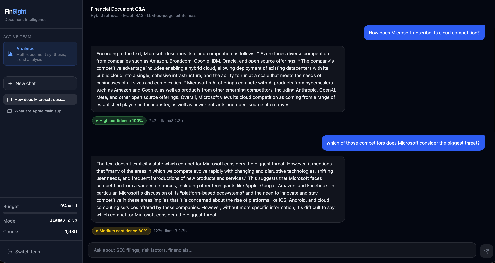
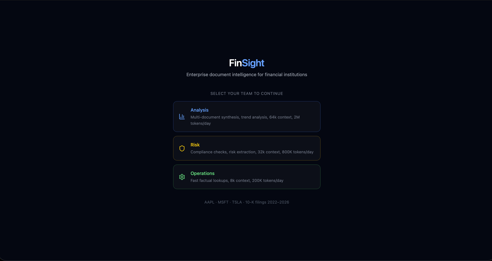

# FinSight

**A multi-agent document intelligence platform for financial institutions.** Ask a question in plain English, like *"which portfolio companies disclosed TSMC supply-chain dependency in the last two quarters?"*, and get a cited, auditable, access-governed answer in seconds, grounded in real SEC filings.

FinSight is built around a **LangGraph multi-agent orchestrator** with a **governed inference harness**: every LLM call is wrapped by input validation, faithfulness scoring, and hallucination detection, and every team operates under its own data-access scope, token budget, and model tier. The orchestration is a designed state machine with explicit failure modes, not model-driven planning, because in a compliance domain you want the degradation paths you specified, not the ones a model improvises.




*A grounded answer with a faithfulness confidence score, followed by a conversational follow-up that resolves against the prior turn. When the filing does not support a claim, the system says so rather than fabricating, and the medium-confidence badge reflects that honestly.*

---

## What makes it interesting

- **Multi-agent orchestration (LangGraph).** An orchestrator classifies intent, extracts entities, and fans out to specialist Retrieval and Graph agents in parallel, then merges, synthesizes, and validates. Every edge in the state machine is explicit, so failure modes are designed: if Neo4j times out, the orchestrator continues vector-only instead of crashing.
- **Governed inference harness.** Each LLM call passes through an input harness (context-quality check, token-budget trimming, prompt-injection scanning, position-bias reordering) and an output harness (LLM-as-judge faithfulness scoring, hallucination flagging on unsourced numbers, PII scrubbing). Faithfulness failures are logged as structured data: specific unsupported claims, not just a score.
- **Multi-tenant isolation, enforced at three layers.** OAuth2 scopes at the gateway, mandatory payload filters in Qdrant, and scope predicates in every Neo4j query. All three must be bypassed simultaneously for a data leak.
- **Hybrid retrieval and Graph RAG.** Dense vectors, SPLADE sparse vectors, and Neo4j graph traversal, fused with Reciprocal Rank Fusion and reranked by a cross-encoder. The graph layer answers relationship questions that vector search structurally cannot.
- **Observable from line one.** OpenTelemetry tracing on every external call, Prometheus and Grafana metrics, and Langfuse RAG traces, instrumented from the first phase rather than retrofitted.

---

## Architecture

```
[ User query + JWT ]
        │
        ▼
[ FastAPI Gateway ]        validate JWT, load tenant config, guardrails,
        │                  sanitize conversation history (injection-scanned)
        ▼
[ LangGraph Orchestrator ] classify intent, extract entities
        │
   ┌────┴───────────┐
   ▼                ▼
[ Retrieval Agent ] [ Graph Agent ]      run in parallel
   │                 │
[ Qdrant dense ]    [ Neo4j Cypher ]
[ Qdrant sparse ]
[ cross-encoder ]
   │                 │
   └───────┬─────────┘
           ▼
   [ Input Harness ]   context validation, token-budget trim,
           │           position-bias reorder, injection detection
           ▼
   [ Synthesis Agent ] → [ Ollama LLM ]
           │
           ▼
   [ Output Harness ]  faithfulness judge, hallucination flags, PII scrub
           │
           ▼
   meter tokens → Redis, write cache → Redis, log trace → Postgres and Langfuse
           │
           ▼
   [ Cited, governed response ]
```

The raw query drives retrieval, entity extraction, and auditing. Prior conversation turns are validated and injection-scanned at the gateway and used only as synthesis context, so history can never pollute the retrieval filter or the faithfulness score.

---

## Who uses it

Three tenant teams with deliberately different profiles. Multi-tenancy is a load-bearing design constraint, not a feature flag.



| Team | Priority | Daily token budget | Context window | Data scope |
|---|---|---|---|---|
| Analysis | P1 | 2M tokens | 64k | all filings |
| Risk | P2 | 800k tokens | 32k | public filings |
| Ops | P3 | 200k tokens | 8k | public filings |

---

## Measured evaluation

A 15-query golden dataset (across AAPL, MSFT, TSLA) runs as a CI gate and blocks merges on regression. Metrics are computed as structured LLM-as-judge prompts.

| Metric | Score | Threshold |
|---|---|---|
| Context Precision | 0.615 | 0.60 |
| Context Recall | 0.677 | 0.60 |
| Faithfulness | 0.809 | 0.75 |
| Answer Relevancy | 0.900 | 0.60 |

*Caveat: the corpus is three companies, not the S&P 500, and the standalone eval pipeline does not use graph context (the production orchestrator does). Scores are computed on the 13 non-adversarial queries in the golden set.*

---

## Tech stack

| Concern | Choice |
|---|---|
| Agent orchestration | LangGraph (explicit state machine) |
| Vector store | Qdrant (dense and SPLADE sparse, native payload filtering) |
| Graph DB | Neo4j (Cypher relationship traversal) |
| LLM serving | Ollama (OpenAI-compatible, one env var swaps to vLLM or a hosted API) |
| Embeddings and rerank | nomic-embed-text, cross-encoder ms-marco-MiniLM |
| Auth | OAuth2 client credentials, JWT scopes |
| Event streaming | Redis Streams (Kafka-compatible semantics) |
| Observability | OpenTelemetry, Prometheus and Grafana, Langfuse |
| Model registry | MLflow (promotion gates, drift detection) |
| API and frontend | FastAPI, with a React and TypeScript frontend on Vite |

Several choices are deliberate local-dev substitutions with documented production swaps: Redis Streams for Kafka, Qdrant sparse vectors for Elasticsearch, Ollama for vLLM. The rationale for each is in [decision_log.md](decision_log.md).

---

## Run it

Requires Docker, Python 3.12, and [Ollama](https://ollama.com).

```bash
# 1. start infrastructure (Postgres, Qdrant, Redis, Neo4j, Ollama, OTEL)
docker compose --profile full up -d

# 2. pull the local models
ollama pull llama3.2:3b
ollama pull nomic-embed-text

# 3. install and set up
pip install -e ".[dev]"
python scripts/migrate.py          # apply DB schema
python scripts/seed_tenants.py     # seed the three teams
python scripts/ingest_test_doc.py  # ingest sample filing data

# 4. run the gateway
uvicorn finsight.gateway.api:app --port 8080
```

Then the frontend:

```bash
cd frontend
npm install
npm run dev    # http://localhost:5173
```

Run the test suite (312 unit tests, no services required):

```bash
pytest tests/unit -v
```

---

## Repository layout

```
finsight/
├── agents/          orchestrator with retrieval, graph, synthesis agents
├── harness/         input, output, eval harnesses
├── mcp_servers/     independently deployable tool servers
├── auth/            OAuth2 server, JWT validation, scope definitions
├── ingestion/       Redis Streams pipeline, chunkers, entity resolution
├── gateway/         FastAPI app, tenant config, token broker
├── models/          Pydantic contracts (types only, no logic)
├── services/        Qdrant, LLM, reranker, circuit breaker, metrics
├── mlops/           model registry, drift detector, reindex pipeline
├── eval/            golden dataset, offline eval, CI gate
├── telemetry/       OpenTelemetry setup
├── tests/           unit, eval, chaos tests
└── frontend/        React, TypeScript, Vite
```

---

*Built as a portfolio project demonstrating production-grade agentic AI infrastructure: multi-agent orchestration, governed inference, multi-tenant isolation, and observability, designed to the standards a regulated financial institution would actually deploy.*